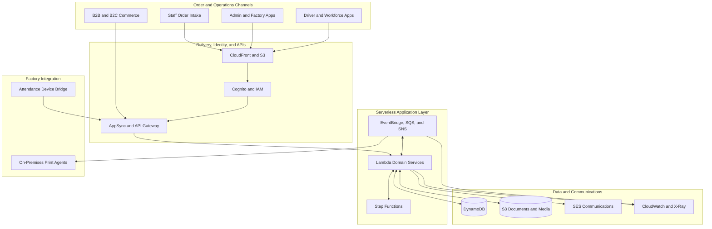
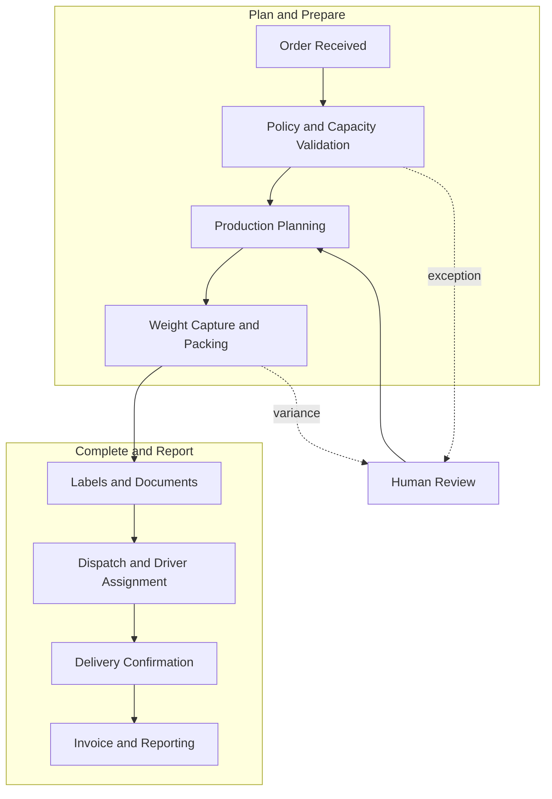

# Shuaib Sahib

## Cloud, Full-Stack, and Operational Systems Builder

I take operational problems from discovery through architecture, implementation, deployment, and production support. My work connects commerce, office teams, factory workflows, drivers, finance, and workforce operations without losing sight of the people using each tool.

My engineering focus is serverless AWS architecture, full-stack applications, event-driven workflows, hybrid cloud and on-premises integration, data integrity, and safe production operations.

## Featured Case Study: MeatOrderPro

MeatOrderPro is a private production platform built for an Australian meat processing and distribution business. It coordinates wholesale and retail orders from checkout through factory production, weight capture, packing, dispatch, delivery, invoicing, and reporting.

| Dimension | Scope |
|---|---|
| Business model | B2B wholesale and B2C retail |
| Users | Customers, office staff, managers, factory operators, and drivers |
| Operating surface | Storefronts, admin tools, factory displays, mobile workflows, and on-premises devices |
| Architecture | Serverless AWS services, event-driven workflows, and factory-edge integrations |
| Contribution | End-to-end work across product discovery, architecture, implementation, deployment, observability, and recovery |

The source code, infrastructure identifiers, production endpoints, customer and staff data, and operational runbooks are private. This showcase contains intentionally high-level, sanitized diagrams and descriptions.

## Operational Value

- Connected order capture, factory preparation, dispatch, delivery, finance, and workforce processes through one traceable operating model.
- Reduced repeated data entry and manual handoffs with event-driven routing, generated documents, notifications, and reporting.
- Put role-specific tools at the point of work for office, factory, management, and field users.
- Enforced fresh-product, access, payment, and financial rules in backend services instead of relying only on interface behavior.
- Made high-risk corrections recoverable through audit metadata, backups, deterministic replay, and field-level reconciliation.

Commercial volumes, customer counts, and financial impact metrics are intentionally retained as confidential operating data.

### Platform Architecture

### Order Lifecycle

### AWS Services by Stage

| Stage | AWS services | Role in the platform |
|---|---|---|
| Web delivery and secure access | CloudFront, S3, Cognito, IAM | Deliver the web applications and enforce authenticated, role-based access |
| Order intake and APIs | AppSync, API Gateway, Lambda | Provide GraphQL and HTTP entry points for ordering and operational tools |
| Validation and operational data | Lambda, DynamoDB | Apply fresh-product rules and persist orders, capacity, inventory, and workflow state |
| Workflow orchestration and background processing | Step Functions, EventBridge, SQS, SNS | Coordinate workflows, schedule jobs, decouple services, and fan out events |
| Weight capture, packing, and factory output | Lambda, DynamoDB, SQS, S3 | Persist packed weights, queue print jobs, and store generated documents |
| Dispatch and driver delivery | AppSync, Lambda, DynamoDB, S3, EventBridge | Assign work, track delivery state, retain proof, and emit completion events |
| Invoicing, statements, and communication | Lambda, DynamoDB, S3, SES | Generate financial documents, archive them, and send customer communications |
| Time and attendance | API Gateway, Lambda, DynamoDB, S3, Cognito | Securely process punches, maintain live status, and generate timesheets |
| Monitoring and recovery | CloudWatch, X-Ray, CloudWatch Synthetics, SNS | Centralize logs, metrics, traces, health checks, and operational alerts |
| Voice-assisted staff intake | Transcribe, Lambda | Convert staff speech to text for deterministic order processing |
| Optional operations alerts | Bedrock, Lambda | Provide a designed generative-alert capability that is intentionally disabled |
| Security and configuration | IAM, Cognito, Secrets Manager, Systems Manager Parameter Store | Apply least-privilege access and keep credentials and runtime configuration out of source code |

## Work Delivered

### Commerce and Order Capture

- **Multi-channel ordering:** unified wholesale, retail, staff-entered, and message-based orders behind one operational lifecycle.
- **Fresh-product fulfilment:** per-product lead times, channel cutoffs, blackout dates, fulfilment eligibility, delivery zones, slot capacity, and strict mixed-cart date validation.
- **Intelligent intake:** deterministic parsing of free-form orders, customer and product alias resolution, canonical SKU mapping, historical price and unit suggestions with manual override, confidence controls, and human review paths.
- **Storefront engineering:** delivery and checkout UX, mobile navigation and cart flows, payment-wallet compatibility, shipping thresholds, product content, transactional messaging, caching, and performance work.

### Factory and Fulfilment

- **Admin operations:** order creation and editing, customer profiles, search and filters, carry-forward workflows, weight entry, role-scoped views, analytics, finance controls, and recovery actions.
- **Factory smartboard:** live preparation views, status transitions, touch-friendly controls, persistent layouts, preparation windows, print readiness, and manually controlled stock visibility.
- **Variable-weight processing:** maximum-value authorization, actual packed-weight capture, line and order recalculation, payment capture or refund handling, finance snapshot refresh, and customer confirmation.
- **Printing and documents:** queued thermal, shipping, box, invoice, packing, and dispatch output with barcode generation, pack splitting, retry handling, deduplication, and post-print reconciliation.
- **Dispatch and delivery:** van and driver assignment, route planning, live location updates, proof of delivery, delivery-code validation, failed-delivery handling, manifests, and completion events.

### Finance and Workforce

- **Invoices and statements:** per-order documents, weekly customer statements, credits, paid and reversed states, date-range views, archive and restore policies, printing, and controlled customer delivery.
- **Operational finance:** persisted finance snapshots, supplier and commission allocations, freight and packaging treatment, payment splits, weekly reporting, and reconciliation controls.
- **Time and attendance:** physical-device and remote punches, duplicate suppression, manual corrections, daylight-saving handling, live clocked-in state, daily and weekly aggregation, and office printing.

### Data and Platform Engineering

- **Data integrity:** canonical product, customer, branch, address, freight, and order-line identities across intake, admin, printing, invoices, and historical repair workflows.
- **History-backed suggestion engine:** customer, item, unit, and pricing recommendations based on approved historical data, constrained by current source evidence and explicit human corrections.
- **Security:** Cognito group authorization, least-privilege IAM, protected admin operations, secret isolation, session controls, and authorization-safe PWA cache refresh.
- **Reliability:** asynchronous events and queues, idempotency, bounded retries, dead-letter handling, health checks, alarms, tracing, retention policies, and recovery tooling.
- **Deployment discipline:** canonical service registry, versioned web assets, scripted deployments, cache invalidation, rollback artifacts, data backups, reconciliation checks, and repository hygiene.

## Engineering Challenges Solved

| Challenge | Approach |
|---|---|
| Ambiguous free-form orders | Source-anchored parsing, canonical aliases, confidence thresholds, semantic guards, and deterministic replay |
| Variable product weights | Authorize a safe maximum, capture confirmed packed weights, then recalculate payments, documents, and finance snapshots |
| Cross-system state changes | Event-driven transitions, idempotent handlers, persisted snapshots, audit metadata, and reconciliation jobs |
| Timezone and daylight-saving errors | Explicit business-timezone calculations for cutoffs, delivery dates, schedules, punches, and reports |
| Factory network and device failures | Durable queues, local agents, retry and deduplication controls, cached fallback, and observable status snapshots |
| Stale installed web applications | Versioned assets and network-first delivery for authorization-critical configuration and code |
| Historical data drift | Non-destructive backups, canonical repair rules, replay tools, and field-level verification before and after changes |

## Quality and Production Practices

- Focused unit and regression tests for parsing, finance, invoices, access control, and data formatting
- End-to-end smoke checks for APIs, order lifecycle transitions, printing, and deployed web assets
- Replay and reconciliation tooling for high-risk data corrections and historical order recovery
- Logs, metrics, traces, synthetic health checks, alarms, and delivery-event tracking
- Point-in-time recovery, versioning, lifecycle policies, rollback snapshots, and non-destructive deployment rules
- A human-readable and machine-readable service registry maintained as the AWS source of truth

## Technology

**AWS:** Lambda, AppSync, API Gateway, Step Functions, DynamoDB, S3, CloudFront, EventBridge, SQS, SNS, SES, Cognito, IAM, Secrets Manager, Systems Manager Parameter Store, CloudWatch, X-Ray, CloudWatch Synthetics, and Transcribe. Bedrock supports an intentionally disabled generative-alert capability.

**Application development:** React, TypeScript, JavaScript, Node.js, Python, PowerShell, PHP, GraphQL, HTML, and CSS.

**Platforms and integrations:** WooCommerce, Stripe, progressive web applications, browser geolocation, thermal printing, attendance devices, and document generation.

**Delivery:** Infrastructure as Code, AWS CLI, Git, automated tests, scripted deployments, smoke tests, and operational runbooks.

## Current Boundaries

| Status | Scope |
|---|---|
| Active production capabilities | Core ordering, admin, factory, printing, dispatch, delivery, invoicing, workforce, voice transcription, and guarded learning workflows |
| Controlled capability | Generative operations alerts are designed but intentionally disabled |
| Voice scope | Transcribe-based transcription supports staff order intake; consumer-facing voice ordering is not deployed |
| Retained compatibility | Some serverless checkout components remain for legacy or selected workflows while live commerce can use storefront-native checkout paths |
| Deliberate manual control | Inventory adjustments remain operator-controlled; automatic stock deduction is not claimed |
| Deliberately private | Source code, endpoints, identifiers, credentials, customer data, operational records, and recovery runbooks |

## Design Priorities

- Keep production data and infrastructure details private
- Validate business rules on the server, not only in the interface
- Make failures observable and recoverable
- Design factory-facing tools for quick, repeated use
- Use managed cloud services where they reduce operational overhead
- Keep human approval available for financially or operationally sensitive decisions

## Repository Access

This repository is a sanitized portfolio overview of a proprietary production system. It contains no application source code or access to live environments.