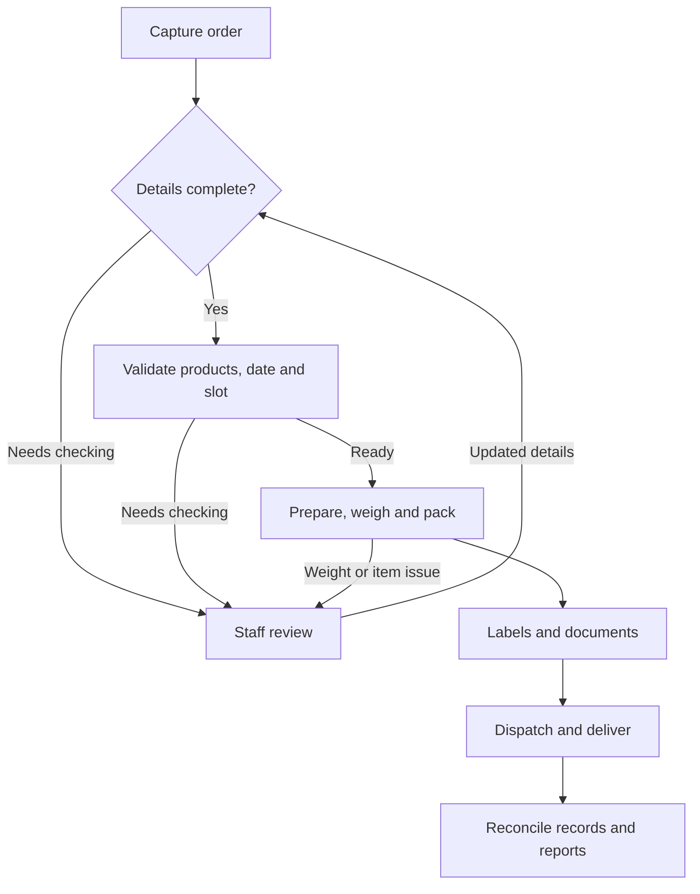
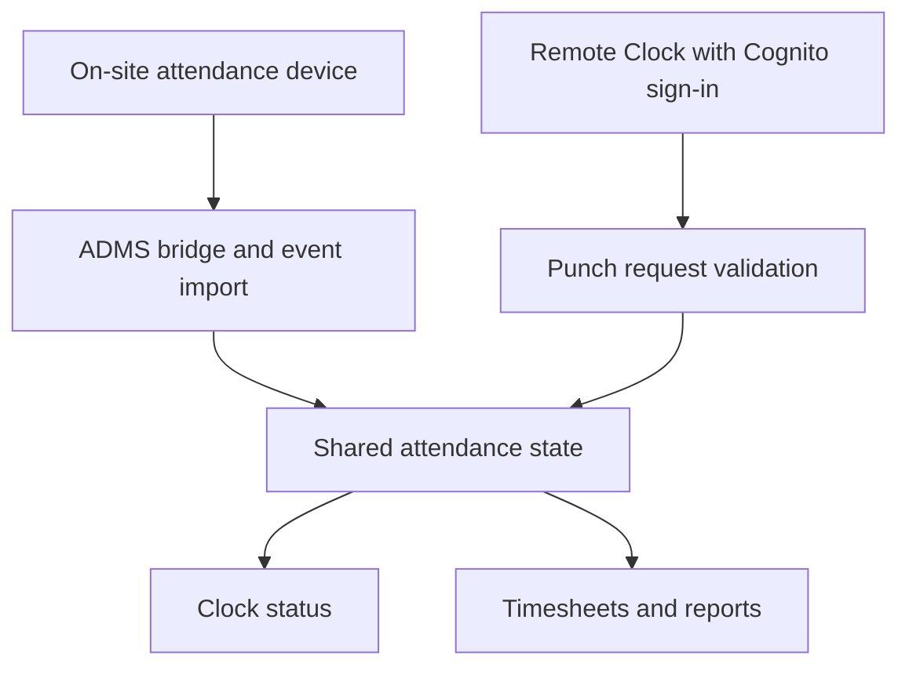
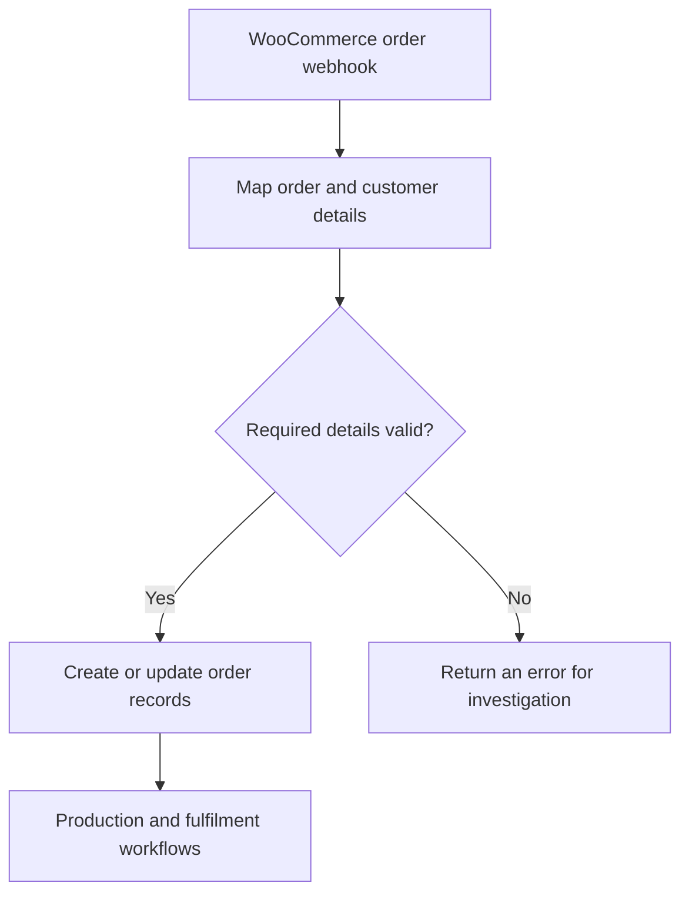

# Shuaib Sahib

## Technical Support, Customer Operations and Business Systems

I work in wholesale operations and customer support, with earlier experience as an NBN telecommunications technician. I enjoy understanding how people use a system, investigating problems and making everyday workflows easier to manage.

I built and supported MeatOrderPro from scratch with AI-assisted development: an internal AWS-based platform for a meat processing and distribution business. Alongside it, I learned WordPress and WooCommerce, set up an online store and connected its ordering workflows with business operations.

## My contribution

I drove the project from the initial business requirements through the build, integration, testing and ongoing support. I used AI coding tools to generate and revise application code while personally directing the work and checking the results against real business needs.

My responsibilities included:

- Gathering requirements from office staff, production teams, managers and drivers.
- Turning operational problems into workflows, acceptance criteria and practical test scenarios.
- Configuring AWS services and permissions through the Management Console.
- Connecting and testing WooCommerce order intake, Remote Clock attendance and on-site ADMS synchronisation.
- Reproducing issues, reviewing logs and settings, and giving AI tools the context needed to work through changes.
- Checking order and invoice parsing, labels, reporting and related outputs against source information.
- Retesting affected workflows, helping business users and documenting the results.

This work brought together software, cloud configuration, physical devices and day-to-day business processes. The examples below show how those parts connect.

## What MeatOrderPro supports

The platform connects wholesale and retail order handling with internal production, dispatch and administration.

| Workflow | Business purpose |
|---|---|
| Orders and customer records | Capture requirements, maintain account details and check products, prices and delivery options |
| Parsing and review | Extract order details, match products and check invoice-source information before relying on the output |
| Production and packing | Present preparation work, record actual weights and prepare labels and documents |
| Dispatch and delivery | Allocate driver work, communicate delivery details and retain proof of delivery |
| Invoices and statements | Produce order documents and support checks of quantities, weights and payment outcomes |
| Time and attendance | Collect attendance information and support timesheet reporting |
| Device and platform integration | Connect attendance devices, sync agents, WordPress and WooCommerce workflows with the wider operating system |

### Simplified order workflow

This conceptual view follows an order through the main business stages. Documents and payment checks can occur at several points.

## Integration workflows

These are simplified, conceptual views of two integration areas. They do not expose production endpoints, account identifiers or private operational data.

### Remote Clock and device synchronisation

The attendance workflow supports clocking in on one channel and clocking out on the other, subject to the configured rules. The on-site ADMS bridge imports device events, while the Remote Clock accepts authenticated web requests. Both contribute to the shared attendance state used for clock status and timesheets.

My work included connecting these components, configuring access, checking staff workflows and investigating discrepancies between the device and web clock.

### WooCommerce and operational ordering

The intake maps WooCommerce order, customer, payment and delivery information into MeatOrderPro. It validates required fields and handles order creation and updates.

My work included setting up the store, checking the integration and following orders through checkout, notifications and fulfilment to investigate unexpected results.

## How I approach support work

1. Clarify what the user was trying to do and what happened instead.
2. Reproduce the affected workflow and record the error or unexpected result.
3. Check relevant logs, permissions, configuration and business data.
4. Use the available evidence when working through a fix and checking proposed changes.
5. Retest the original workflow and check related outputs before treating the issue as resolved.
6. Record the steps and explain the result in language the user understands.

For order and invoice checks, this includes comparing outputs with the source information, such as the product, quantity, weight or price, and recording which examples were checked and what happened.

## Technology used in the platform

| Area | Examples |
|---|---|
| Web delivery and access | CloudFront, S3, Cognito and IAM |
| APIs and application workflows | AppSync, API Gateway, Lambda and Step Functions |
| Data and background work | DynamoDB, EventBridge, SQS and SNS |
| Documents, notifications and monitoring | S3, SES and CloudWatch |
| Commerce and devices | WordPress, WooCommerce, Stripe, label printing and ADMS attendance-device integration |
| AI and parsing | OpenAI API for assisted order parsing, product matching and invoice-source processing |

## Scope and boundaries

- MeatOrderPro is an internal project developed alongside my wholesale operations role.
- Source code, infrastructure identifiers, production endpoints, customer and staff data, credentials and operational records remain private.
- Inventory adjustments remain under staff control; automatic stock deduction is not claimed.
- Staff voice transcription and consumer voice ordering are different capabilities. Consumer-facing voice ordering is not deployed.
- Bedrock smart alerts are a designed capability that remains disabled. Automated catalog and pricing agents are listed as planned work in the main repository.
- This showcase describes selected workflows and contains conceptual diagrams. The application source and live systems remain private.

## Related experience

- **Al-Abrar Halal Meats:** B2B customer service, orders, pricing, invoicing, production coordination and delivery enquiries.
- **NBN field service:** More than 1,500 customer-home appointments across installation, fault diagnosis and customer handover.
- **Waqiah Foods:** WooCommerce setup and operations, online customer enquiries, payments and fulfilment coordination. [Website](https://waqiahfoods.com.au/)

I am interested in product support and technical operations roles where I can combine practical investigation, customer service and continued learning.

