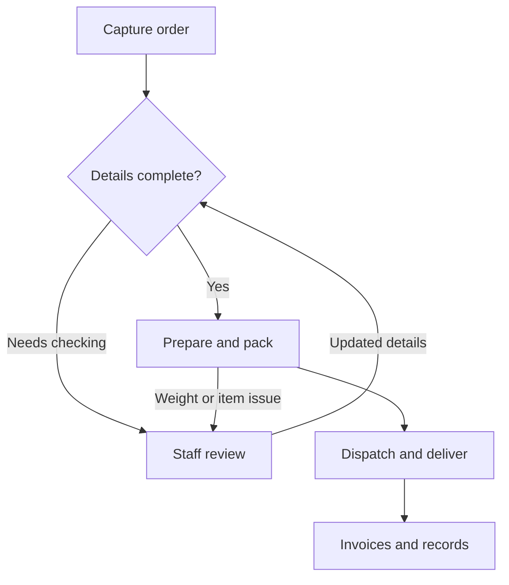

# Shuaib Sahib

## Technical Support, Customer Operations and Business Systems

I work in wholesale operations and customer support, with earlier experience as an NBN telecommunications technician. I enjoy understanding how people use a system, investigating problems and making everyday workflows easier to manage.

My practical technical experience comes from operating WooCommerce and working on MeatOrderPro, an internal AWS-based platform for a meat processing and distribution business.

## My contribution

MeatOrderPro was built from scratch through sustained development and iteration. AI tools supported parts of the implementation, but the work still required directing the build, supplying the business context, resolving problems, and repeatedly testing and refining the result. My personal work focuses on:

- Understanding the needs of office staff, production teams, managers and drivers.
- Turning those needs into workflow requirements and test scenarios.
- Configuring AWS services and permissions through the Management Console.
- Reproducing reported problems and reviewing logs, settings and business data.
- Supplying error details and context, then testing proposed changes.
- Checking that ordering, invoicing, production and delivery workflows behave as expected.
- Helping business users and documenting issues and outcomes.

The wider work included building and integrating a Remote Clock attendance workflow with a physical device and sync agent, as well as learning WordPress and WooCommerce from the ground up and connecting the online ordering workflows with MeatOrderPro's operational processes.

The technology section describes the platform's stack; the responsibilities above describe my personal contribution.

## What MeatOrderPro supports

The platform connects wholesale and retail order handling with internal production, dispatch and administration.

| Workflow | Business purpose |
|---|---|
| Orders and customer records | Capture requirements, maintain account details and check products, prices and delivery options |
| Production and packing | Present preparation work, record actual weights and prepare labels and documents |
| Dispatch and delivery | Allocate driver work, communicate delivery details and retain proof of delivery |
| Invoices and statements | Produce order documents and support checks of quantities, weights and payment outcomes |
| Time and attendance | Collect attendance information and support timesheet reporting |
| Device and platform integration | Connect attendance devices, sync agents, WordPress and WooCommerce workflows with the wider operating system |

### Simplified order workflow

This is a conceptual view of the business process, rather than a deployment diagram.

## Integration workflows

These are simplified, conceptual views of two integration areas. They do not expose production endpoints, account identifiers or private operational data.

### Remote Clock and device synchronisation

The workflow supports staff clocking in or out from either the on-site device or the remote web page. For example, a staff member can clock in remotely and clock out on the device. The on-site ADMS agent synchronises device events with the shared attendance workflow.

### WooCommerce and operational ordering

The ordering integration connects the online store with MeatOrderPro's operational workflow, so order details can be checked before production and fulfilment continue.

## How I approach support work

1. Clarify what the user was trying to do and what happened instead.
2. Reproduce the affected workflow and record the error or unexpected result.
3. Check relevant logs, permissions, configuration and business data.
4. Use the available evidence when working through a fix and checking proposed changes.
5. Retest the original workflow and check related outputs before treating the issue as resolved.
6. Record the steps and explain the result in language the user understands.

For order and invoice checks, this includes comparing outputs with the source information, such as the product, quantity, weight or price, and recording which examples were checked and what happened.

## Technology used in the platform

| Area | Examples |
|---|---|
| Web delivery and access | CloudFront, S3, Cognito and IAM |
| APIs and application workflows | AppSync, API Gateway, Lambda and Step Functions |
| Data and background work | DynamoDB, EventBridge, SQS and SNS |
| Documents, notifications and monitoring | S3, SES, Twilio, CloudWatch and X-Ray |
| Commerce and devices | WooCommerce, Stripe, EC2 print server, Bixolon printing and ADMS attendance-device integrations |
| AI and operational assistance | GPT API for invoice parsing, plus Amazon Bedrock agents for catalog, pricing, fulfilment, support, printing and observability workflows |

## Scope and boundaries

- MeatOrderPro is an internal project developed alongside my wholesale operations role.
- Source code, infrastructure identifiers, production endpoints, customer and staff data, credentials and operational records remain private.
- Inventory adjustments remain under staff control; automatic stock deduction is not claimed.
- Staff voice transcription and consumer voice ordering are different capabilities. Consumer-facing voice ordering is not deployed.
- Generative operations alerts are described as a designed capability that is intentionally disabled.
- This public repository contains project descriptions and a conceptual workflow. Source code and access to live systems remain private.

## Related experience

- **Al-Abrar Halal Meats:** B2B customer service, orders, pricing, invoicing, production coordination and delivery enquiries.
- **NBN field service:** More than 1,500 customer-home appointments across installation, fault diagnosis and customer handover.
- **Waqiah Foods:** WooCommerce setup and operations, online customer enquiries, payments and fulfilment coordination. [Website](https://waqiahfoods.com.au/)

I am interested in product support and technical operations roles where I can combine practical investigation, customer service and continued learning.
