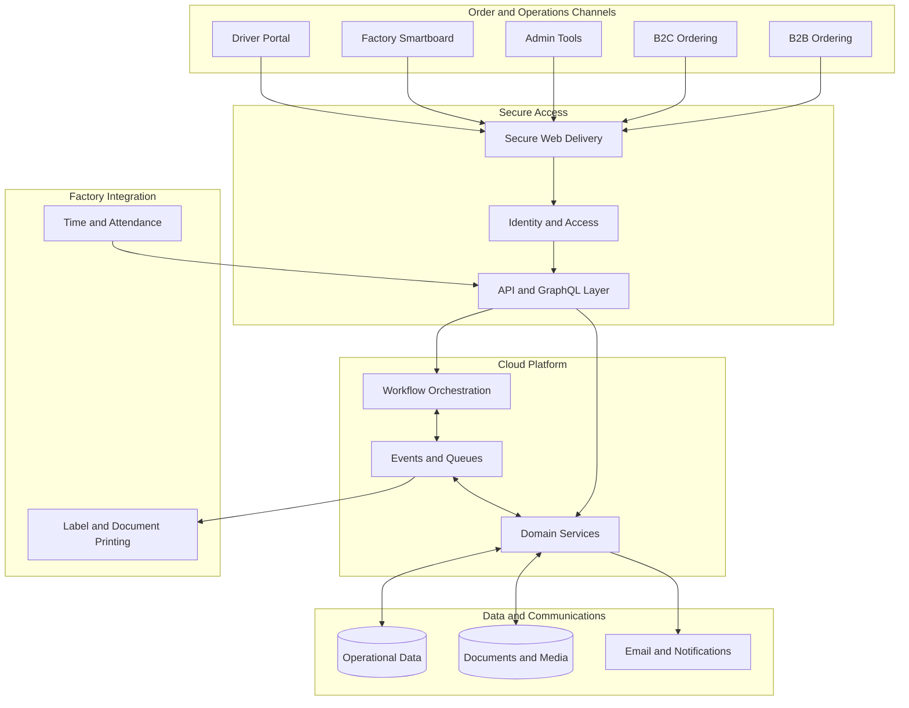
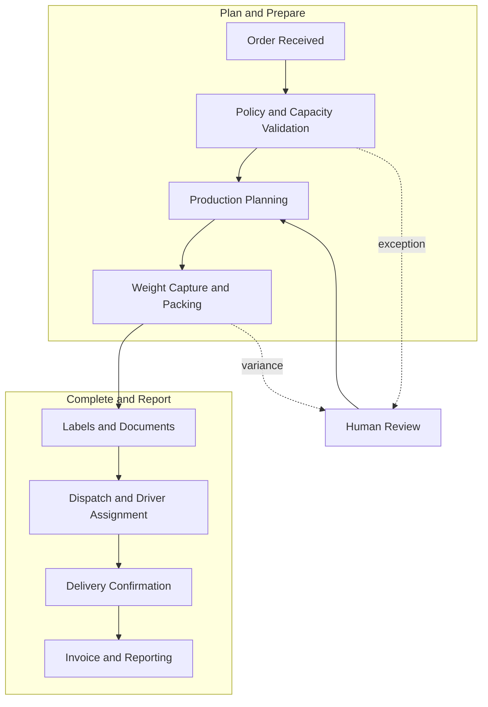

# Shuaib Sahib

## Cloud and Full-Stack Systems Builder

I design and operate practical software that connects customer ordering, factory workflows, dispatch, delivery, invoicing, printing, and workforce operations.

My focus is turning real operational constraints into reliable systems: clear service boundaries, event-driven workflows, secure access, observable production services, and tools that work for both office and factory teams.

## Featured Project: MeatOrderPro

MeatOrderPro is a private production platform built for an Australian meat processing and distribution business. It coordinates wholesale and retail orders from checkout through factory production, weight capture, packing, dispatch, delivery, invoicing, and reporting.

The source code, infrastructure identifiers, production endpoints, customer information, and operational runbooks are private. The diagrams below are intentionally high level.

### Platform Architecture

### Order Lifecycle

### AWS Services by Stage

| Stage | AWS services | Role in the platform |
|---|---|---|
| Web delivery and secure access | CloudFront, S3, Cognito, IAM | Deliver the web applications and enforce authenticated, role-based access |
| Order intake and APIs | AppSync, API Gateway, Lambda | Provide GraphQL and HTTP entry points for ordering and operational tools |
| Validation and operational data | Lambda, DynamoDB | Apply fresh-product rules and persist orders, capacity, inventory, and workflow state |
| Workflow orchestration and background processing | Step Functions, EventBridge, SQS, SNS | Coordinate workflows, schedule jobs, decouple services, and fan out events |
| Weight capture, packing, and factory output | Lambda, DynamoDB, SQS, S3 | Persist packed weights, queue print jobs, and store generated documents |
| Dispatch and driver delivery | AppSync, Lambda, DynamoDB, S3, EventBridge | Assign work, track delivery state, retain proof, and emit completion events |
| Invoicing, statements, and communication | Lambda, DynamoDB, S3, SES | Generate financial documents, archive them, and send customer communications |
| Time and attendance | API Gateway, Lambda, DynamoDB, S3, Cognito | Securely process punches, maintain live status, and generate timesheets |
| Monitoring and recovery | CloudWatch, X-Ray, CloudWatch Synthetics, SNS | Centralize logs, metrics, traces, health checks, and operational alerts |
| Voice and optional AI | Transcribe, Bedrock, Lambda | Support voice-assisted intake and optional generative operations alerts |

## Engineering Scope

- Event-driven services for order processing, fulfilment, dispatch, notifications, and reporting
- Fresh-product rules covering lead times, cutoffs, fulfilment dates, blackout dates, and capacity
- Cognito-backed, role-based web applications for administrators, factory staff, drivers, and managers
- Authorization-safe cache refresh for installed progressive web applications
- On-premises integration for thermal labels, business documents, and attendance devices
- Driver workflows for pickup, routing, location updates, proof of delivery, and completion
- Payment, invoice, statement, and variable-weight order workflows
- Monitoring, audit trails, retry handling, and operational recovery tooling
- Voice transcription and learning-assisted order intake, with optional generative operations alerts kept disabled

## Technology

**AWS:** Lambda, AppSync, API Gateway, Step Functions, DynamoDB, S3, CloudFront, EventBridge, SQS, SNS, SES, Cognito, IAM, CloudWatch, X-Ray, CloudWatch Synthetics, Bedrock, and Transcribe.

**Application tooling:** React, Node.js, Python, PowerShell, and Stripe.

## Design Priorities

- Keep production data and infrastructure details private
- Validate business rules on the server, not only in the interface
- Make failures observable and recoverable
- Design factory-facing tools for quick, repeated use
- Use managed cloud services where they reduce operational overhead
- Keep human approval available for financially or operationally sensitive decisions

## Repository Access

This is a portfolio overview of a proprietary production system. Source code and live environments are not publicly accessible.