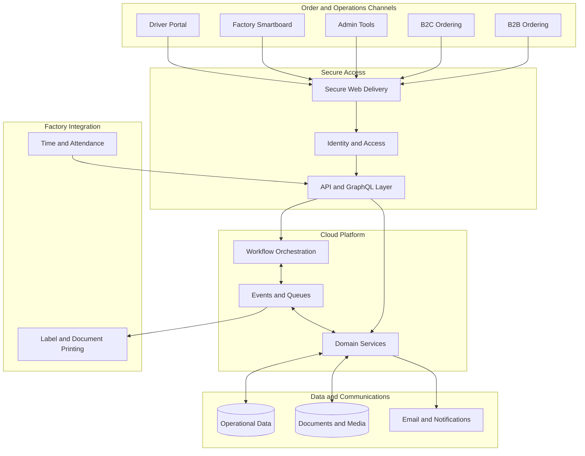
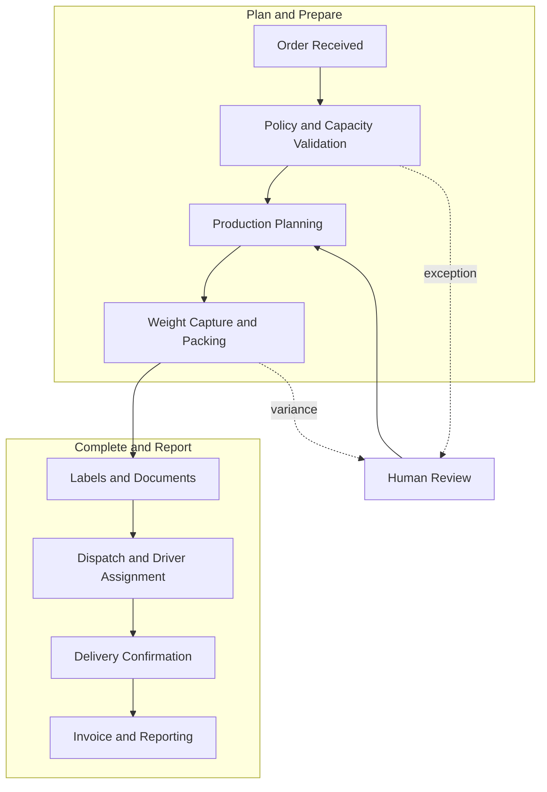

# Shuaib Sahib

## Cloud and Full-Stack Systems Builder

I design and operate practical software that connects customer ordering, factory workflows, dispatch, delivery, invoicing, printing, and workforce operations.

My focus is turning real operational constraints into reliable systems: clear service boundaries, event-driven workflows, secure access, observable production services, and tools that work for both office and factory teams.

## Featured Project: MeatOrderPro

MeatOrderPro is a private production platform built for an Australian meat processing and distribution business. It coordinates wholesale and retail orders from checkout through fulfilment, dispatch, delivery, invoicing, and reporting.

The source code, infrastructure identifiers, production endpoints, customer information, and operational runbooks are private. The diagrams below are intentionally high level.

### Platform Architecture

### Order Lifecycle

## Engineering Scope

- Event-driven services for order processing, fulfilment, dispatch, notifications, and reporting
- Fresh-product rules covering lead times, cutoffs, fulfilment dates, blackout dates, and capacity
- Role-based web applications for administrators, factory staff, drivers, and managers
- On-premises integration for thermal labels, business documents, and attendance devices
- Payment, invoice, statement, and variable-weight order workflows
- Monitoring, audit trails, retry handling, and operational recovery tooling
- AI-assisted order intake and workflow suggestions with human review controls

## Technology

AWS Lambda, AppSync, API Gateway, Step Functions, DynamoDB, S3, CloudFront, EventBridge, SQS, SES, Cognito, CloudWatch, React, Node.js, Python, and PowerShell.

## Design Priorities

- Keep production data and infrastructure details private
- Validate business rules on the server, not only in the interface
- Make failures observable and recoverable
- Design factory-facing tools for quick, repeated use
- Use managed cloud services where they reduce operational overhead
- Keep human approval available for financially or operationally sensitive decisions

## Repository Access

This is a portfolio overview of a proprietary production system. Source code and live environments are not publicly accessible.